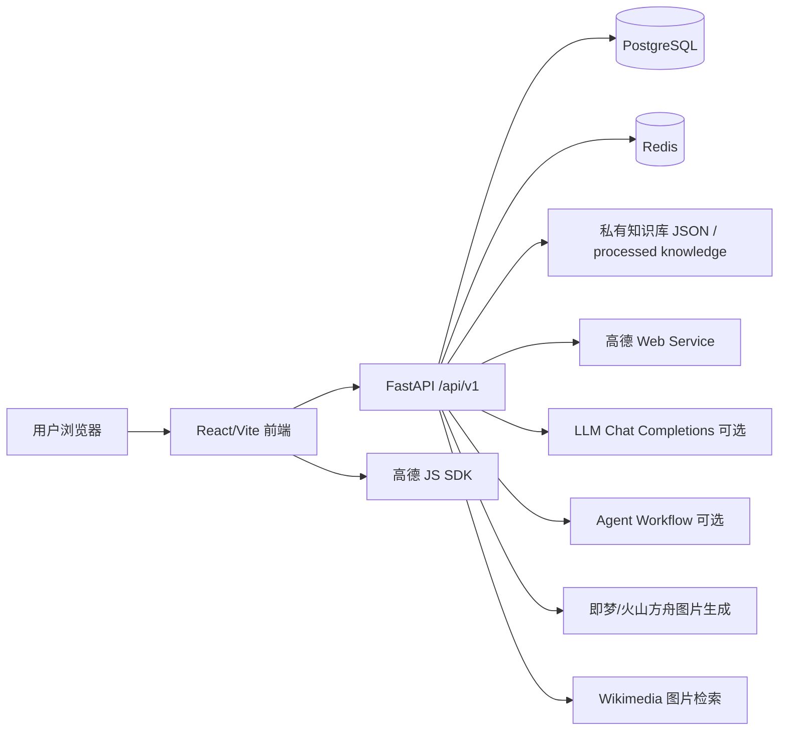

# 旅图 Lv 完整技术设计文档

> Author: AIPM AmoryZ  
> Last updated: 2026-07-09  
> 文档范围：解释旅图当前产品的核心功能、实现路径、关键策略、Prompt 与数据中台口径。  
> 安全说明：本文只记录环境变量名称和实现逻辑，不记录 `.env`、API Key、服务器密码、私有数据库内容或真实用户隐私数据。

---

## 0. 当前版本结论

旅图 Lv 是一个「AI + 本地知识库」驱动的旅行规划产品，核心闭环是：

```text
用户输入偏好
  -> 目的地推荐
  -> 选择目的地
  -> 生成差异化路线方案
  -> 选择方案并创建完整行程
  -> 行程详情页继续编辑 / 看地图 / 看机位 / 看穿搭 / 生成穿搭 AI 预览 / 打包准备
  -> 数据中台监控漏斗、页面停留、按钮点击率、选择比例
```

当前代码中需要特别说明的版本事实：

1. **目的地推荐页首屏展示 3 个目的地**；如果后端返回超过 3 个，用户点击「换一批目的地」后按 3 个一组轮换。
2. **路线对比当前是 2 套方案**：A=经典初访覆盖线，B=复访深度出片线。Prompt 和知识库策略都明确要求两套路线差异化。
3. **穿搭推荐当前至少补齐 6 套**：女生 3 套、男生 3 套；AI 生图只用于穿搭预览，不用于路线或目的地图片生成。
4. **地图有前后端两套高德能力**：前端 Web JS Key 用于交互地图；后端 Web Service Key 用于天气、POI/geocode 查询。
5. **数据中台是独立路径 `/data-center`**，产品主页和侧边栏不暴露入口，需要白名单免密登录。

---

## 1. 总体架构

### 1.1 技术栈

| 层级 | 技术 | 作用 |
|---|---|---|
| 前端 | React + TypeScript + Vite | 页面、交互、状态、埋点、地图 SDK 加载 |
| 前端状态 | Zustand | 保存推荐结果、路线方案、登录态、UI Toast |
| 后端 | FastAPI | REST API、WebSocket、统一响应、异常处理 |
| ORM | SQLAlchemy | 用户、行程、机位、穿搭、埋点等模型 |
| 数据库 | PostgreSQL（生产）/ 本地开发可按环境配置 | 业务数据、埋点数据、白名单账号 |
| 缓存 | Redis | 生产容器中提供缓存基础能力 |
| AI 推荐 | mock / knowledge / LLM provider | 目的地推荐策略 |
| AI 路线 | mock / knowledge / Agent provider | 路线规划策略 |
| 图片 | Wikimedia 查询 + 本地图卡兜底 + 即梦/火山方舟生图 | 目的地/路线图片与穿搭 AI 预览 |
| 地图/天气 | 高德 JS SDK + 高德 Web Service | 地图展示、天气、POI/geocode |
| 数据中台 | 自研埋点 + 聚合 API | 漏斗、停留、按钮点击率、选择占比 |

### 1.2 架构图



### 1.3 关键目录

| 目录/文件 | 职责 |
|---|---|
| `frontend/src/pages/StartPage.tsx` | 偏好输入页，触发目的地推荐 |
| `frontend/src/pages/DestinationsPage.tsx` | 目的地推荐页，3 个一组展示与换一批 |
| `frontend/src/pages/ComparisonPage.tsx` | 路线对比页，生成路线、评分解释、创建完整行程 |
| `frontend/src/pages/TripDetailPage.tsx` | 行程详情页，行程/地图/穿搭/机位/打包/自然语言调整 |
| `frontend/src/pages/AnalyticsPage.tsx` | 独立数据中台页面 |
| `frontend/src/hooks/useAnalytics.ts` | 全局自动埋点：PV、停留、点击、表单 |
| `backend/app/api/v1/planning.py` | 目的地、路线、天气、媒体占位 API |
| `backend/app/integrations/knowledge.py` | 本地知识库推荐与路线规划核心策略 |
| `backend/app/integrations/prompts/*.py` | LLM/Agent Prompt 模板 |
| `backend/app/api/v1/core_business.py` | 行程、行程天、行程点、打包清单 CRUD |
| `backend/app/api/v1/outfits.py` | 穿搭 CRUD 与 AI 生图接口 |
| `backend/app/api/v1/spots.py` | 机位 CRUD |
| `backend/app/api/v1/adjustments.py` | 自然语言行程调整 |
| `backend/app/api/v1/analytics.py` | 埋点接收与数据中台指标聚合 |
| `backend/app/api/v1/auth.py` | 普通登录注册、数据中台白名单免密登录 |
| `backend/app/integrations/outfit_image_generation.py` | 穿搭 AI 生图 Prompt 与调用火山方舟/即梦 |

---

## 2. 前端路由与页面职责

路由定义在 `frontend/src/App.tsx`。

| 路由 | 页面 | 是否主产品入口 | 说明 |
|---|---|---:|---|
| `/` | `HomePage` | 是 | 产品首页 |
| `/start` | `StartPage` | 是 | 输入旅行偏好，生成目的地推荐 |
| `/destinations` | `DestinationsPage` | 是 | 展示推荐目的地，首屏 3 个，支持换一批 |
| `/comparison` | `ComparisonPage` | 是 | 展示两套差异化路线，用户选择后创建完整行程 |
| `/trips/:tripId` | `TripDetailPage` | 是 | 行程详情、地图、穿搭、机位、打包、AI 调整 |
| `/login` | `LoginPage` | 否 | 普通登录注册；当 redirect=/data-center 时进入中台免密登录模式 |
| `/data-center` | `AnalyticsPage` | 否 | 独立数据中台，不从产品主页直接进入 |
| `/analytics` | 重定向到 `/data-center` | 否 | 历史兼容入口 |

---

## 3. 后端 API 分层

所有主接口挂载在 `/api/v1` 下，路由聚合在 `backend/app/api/router.py`。

| 模块 | 路径前缀 | 文件 | 主要能力 |
|---|---|---|---|
| Health | `/health` | `health.py` | 存活检查 |
| Auth | `/auth` | `auth.py` | 注册、登录、刷新 Token、中台白名单 |
| Planning | `/planning` | `planning.py` | 目的地推荐、路线生成、天气、媒体占位 |
| Core business | 无额外前缀 | `core_business.py` | 用户、行程、行程天、行程点、打包清单 CRUD |
| Outfits | 无额外前缀 | `outfits.py` | 穿搭列表/创建/更新/删除/AI 预览图 |
| Spots | 无额外前缀 | `spots.py` | 机位列表/创建/更新/删除 |
| Adjustments | 无额外前缀 | `adjustments.py` | 自然语言改行程 |
| Versions | 无额外前缀 | `versions.py` | 行程版本快照与恢复 |
| Analytics | `/analytics` | `analytics.py` | 埋点写入与中台 dashboard |
| Knowledge | `/knowledge` | `knowledge.py` | 知识库查询、POI 查询 |
| Media | `/media` | `media.py` | 本地 SVG 图卡生成 |
| WebSocket | 无额外前缀 | `ws.py` | 行程协同编辑 |

---

## 4. 数据模型概览

### 4.1 用户与权限

| 模型 | 作用 |
|---|---|
| `User` | 用户账号，含 email、username、display_name、password_hash |
| `UserPreference` | 用户偏好，如出发城市、预算、语言、时区 |
| `AnalyticsAdmin` | 数据中台白名单账号，免密登录权限来自这里或环境变量 |

### 4.2 行程核心

| 模型 | 作用 |
|---|---|
| `Trip` | 一次旅行项目，含标题、目的地、状态、封面、备注 |
| `TripDay` | 行程第 N 天，含主题与 summary |
| `TripPoint` | 某一天的具体点位，含名称、地址、经纬度、开始时间、排序、图片 |
| `PackingItem` | 打包清单项，含分类、数量、是否已打包 |
| `TripVersion` | 行程快照，用于版本历史和恢复 |
| `Collaborator` | 协同编辑相关角色与模块锁 |

### 4.3 推荐结果与知识

| 模型 | 作用 |
|---|---|
| `Destination` | 结构化目的地基础库 |
| `DestinationCandidate` | 推荐候选与缓存 |
| `PhotoSpot` | 通用机位知识库 |
| `PhotoSpotRecommendation` | 某次行程下的机位推荐 |
| `Outfit` | 通用穿搭知识库 |
| `OutfitRecommendation` | 某次行程下的穿搭推荐 |
| `TravelNote` | UGC/人工摘要/来源证据类旅行笔记 |
| `PlanVariant` | 多方案路线结构化结果 |
| `GenerationJob` | 异步推荐/路线/调整任务状态 |

### 4.4 数据中台

| 模型 | 作用 |
|---|---|
| `AnalyticsEvent` | 存储 page_view、button_click、page_leave、业务转化事件等 |
| `UserBehavior` | 通用用户行为记录，当前核心中台主要用 `AnalyticsEvent` |

---

## 5. 核心功能实现路径

### 5.1 偏好输入与目的地推荐

**用户路径**

```text
/start 输入天数/兴趣/预算/季节等
  -> recommendDestinationsAsync 或 recommendDestinations
  -> /api/v1/planning/destinations 或 /destinations/async
  -> planning_service.get_destination_recommendations
  -> integrations.factory.get_recommender_integration
  -> mock / knowledge / RealLLMRecommendationIntegration
  -> 返回 DestinationRecommendationPayload
  -> Zustand 保存
  -> 跳转 /destinations
```

**关键文件**

- 前端：`frontend/src/pages/StartPage.tsx`
- 服务：`frontend/src/services/planning.ts`
- 后端 API：`backend/app/api/v1/planning.py`
- 服务层：`backend/app/services/planning_service.py`
- Provider 工厂：`backend/app/integrations/factory.py`
- 知识库策略：`backend/app/integrations/knowledge.py`
- LLM Prompt：`backend/app/integrations/prompts/destination.py`

**Provider 选择逻辑**

`get_recommender_integration(settings)`：

1. `AI_PROVIDER=mock`：返回 Mock 目的地。
2. `AI_PROVIDER=knowledge` 或 `local`：走本地知识库 `KnowledgeRecommendationIntegration`。
3. 有 `AI_API_KEY`、`AI_BASE_URL`、`AI_MODEL_NAME`：走兼容 OpenAI Chat Completions 的真实 LLM。
4. 关键配置缺失：降级 Mock，避免产品不可用。

### 5.2 目的地推荐页展示与“换一批”

**用户路径**

```text
/destinations
  -> 从 tripStore 读取推荐结果
  -> 如果没有推荐结果，用默认参数重新请求
  -> destinationBatch 每次取 3 个
  -> 点击「换一批目的地」递增 batchIndex
  -> 点击目的地进入 /comparison
```

**关键策略**

- `DESTINATION_BATCH_SIZE = 3`。
- 后端如果返回 6 个城市，前端按 3 个一组轮换。
- 如果后端只返回 3 个，点击「换一批」会重新发起推荐。
- 图片优先级：真实图片 URL > 本地图卡/渐变兜底。

### 5.3 路线生成与方案对比

**用户路径**

```text
选择目的地
  -> /comparison
  -> generateRoutes({ destination_name, duration_days })
  -> /api/v1/planning/routes
  -> get_route_generation
  -> get_route_planner_integration
  -> mock / knowledge / RealRoutePlannerIntegration
  -> 返回 RouteGenerationPayload
  -> 前端转换为 PlanOption
  -> 用户选择 A/B 方案
```

**关键文件**

- 前端：`frontend/src/pages/ComparisonPage.tsx`
- 后端 API：`backend/app/api/v1/planning.py`
- 路线策略：`backend/app/integrations/knowledge.py`
- Agent Prompt：`backend/app/integrations/prompts/route.py`
- Agent 调用：`backend/app/integrations/agent/real_agent.py`

**当前路线数量**

当前实现返回 **2 个 options**：

1. `knowledge-first-timer`：经典初访覆盖线。
2. `knowledge-repeat-visitor`：复访深度出片线。

这与 `route.py` Prompt 中“必须且只能 2 个”一致。

### 5.4 选择方案并创建完整行程

**用户路径**

```text
点击「选择此方案 · 生成行程」
  -> 如果未登录，跳转登录
  -> createTrip 创建 Trip
  -> createGeneratedTripContent 写入完整内容：
       1. TripDay
       2. TripPoint
       3. PhotoSpotRecommendation
       4. OutfitRecommendation
       5. PackingItem
  -> 埋点 route_option_confirmed + trip_created
  -> 跳转 /trips/:tripId
```

**生成内容策略**

| 内容 | 生成方式 |
|---|---|
| 每日行程 | 遍历 `RouteOption.days` 创建 `TripDay` |
| 行程点 | 遍历 `day.spots` 创建 `TripPoint`，保留地址、经纬度、时间、图片 |
| 机位 | 从 spot 文本中筛选拍照/机位/观景/日落/海/山/公园/景区类点位，最多 5 个 |
| 穿搭 | 固定创建女生 3 套 + 男生 3 套场景化穿搭 seed |
| 打包 | 默认创建证件、充电器、充电宝、拍照设备、防晒、常用药等基础清单 |

### 5.5 行程详情页

`TripDetailPage` 包含四个子 Tab：

| Tab | 关键能力 |
|---|---|
| 行程 | 地图、行程点编辑、拖拽排序、自然语言调整、自动保存 |
| 穿搭 | 男女分组展示、详情弹窗、点击生成 AI 预览图 |
| 机位 | 机位卡片、构图建议、最佳时段、删除 |
| 打包 | 清单勾选、添加、删除、打包进度、天气与注意事项 |

**加载路径**

```text
/trips/:tripId
  -> getTrip
  -> listTripDays
  -> listPackingItems
  -> listOutfits
  -> listSpots
  -> listTripPoints per day
  -> getDestinationWeather
```

**自动保存**

- `useAutoSave(pointDrafts, savePointDrafts, 1500)`。
- 用户编辑行程点名称、时间、备注后，1.5 秒 debounce 调用 `updateTripPoint`。
- 保存状态显示为：保存中 / 已保存 / 保存失败。

**拖拽排序**

- 前端拖拽改变同一天内 `TripPoint` 顺序。
- 后端 `reorderTripPoints` 接收 ordered ids，重新分配 `sort_order`。

### 5.6 地图展示

**前端路径**

```text
TripDetailPage
  -> 从 pointsByDay 中筛出有 latitude/longitude 的点
  -> MapView(points)
  -> 动态加载 https://webapi.amap.com/maps?v=2.0&key=...
  -> AMap.Map + AMap.Marker
  -> setFitView 自动适配视野
```

**降级策略**

- 如果没有 `VITE_AMAP_KEY` 或 SDK 加载失败，显示“地图服务待启用/地图加载失败”。
- 同时展示最多 6 个点位清单和经纬度，保证用户仍能核对路线。

### 5.7 天气与打包注意事项

**天气路径**

```text
TripDetailPage
  -> getDestinationWeather(destinationName)
  -> /api/v1/planning/weather
  -> AmapClient.geocode(destinationName)
  -> AmapClient.weather_live(adcode/city)
  -> 返回 DestinationWeatherPayload
```

**打包提示策略**

`buildPackingNotices` 基于以下信息生成最多 5 条提示：

- 高德实时天气：雨/雷/雪、高温、低温。
- 路线文本：山地/栈道、水边、夜景/日落/观景/机位。
- 行程长度：超过 3 天提示衣物复用与减重。
- 固定兜底：出发前 24 小时复核天气、开放时间和预约规则。

### 5.8 穿搭推荐与男女分组

**生成策略**

在 `ComparisonPage.createGeneratedTripContent` 中创建 6 套 seed：

| 性别 | 场景 | 风格 |
|---|---|---|
| 女生 | 城市漫步 / 景点拍照 | 女生轻户外舒适穿搭 |
| 女生 | 日落 / 观景台 | 女生出片层次感穿搭 |
| 女生 | 美食街 / 夜游 | 女生夜游轻便出片穿搭 |
| 男生 | 城市漫步 / 景点拍照 | 男生轻户外舒适穿搭 |
| 男生 | 日落 / 观景台 | 男生出片层次感穿搭 |
| 男生 | 美食街 / 夜游 | 男生夜游轻便出片穿搭 |

**补齐策略**

`TripDetailPage.ensureMinimumOutfits`：

- 加载已有穿搭后，按 `inferOutfitGender` 分组。
- 如果女生不足 3 套，补齐女生 seed。
- 如果男生不足 3 套，补齐男生 seed。

**性别识别策略**

`frontend/src/utils/outfitImages.ts` 与后端生图 prompt 中都有性别推断：

1. 优先读取 item 上明确的 `gender`。
2. 如果只有 `female` 且没有 `male`，判定女生。
3. 如果只有 `male` 且没有 `female`，判定男生。
4. 否则用中文/英文关键词兜底：女生、女士、女性、女装、female、womenswear；男生、男士、男性、男装、male、menswear。
5. 都无法识别时为通用/旅行者。

### 5.9 AI 穿搭预览图

**用户路径**

```text
穿搭卡片点击「生成预览」
  -> generateOutfitPreviewImage(outfitId, force=true)
  -> POST /api/v1/outfits/{outfit_id}/preview-image
  -> build_outfit_preview_prompt
  -> VolcengineOutfitImageClient.generate
  -> 保存 image_url 到 OutfitRecommendation.images[0]
  -> 前端卡片和详情页展示真实生成图
```

**设计原则**

- 图卡未生成前展示模糊/渐变背景和「点击生成 AI 预览」。
- 点击“查看详情”和“生成预览”分离，避免误触直接消耗生图额度。
- 详情页不展示 prompt，只展示穿搭方案、原因和图片。
- 后端如果已有图片且 `force=false`，不会重复生成；当前前端调用 `force=true` 支持重新生成。

### 5.10 机位推荐

**生成路径**

```text
选择路线创建行程
  -> 从 RouteOption.days[].spots 中筛选 photoCandidates
  -> createSpot 写入 PhotoSpotRecommendation
  -> /trips/:tripId/spots 展示
```

**候选筛选规则**

前端用文本正则筛选包含以下信号的点位：

```text
拍照 / 机位 / 观景 / 日落 / 海 / 山 / 公园 / 景区
```

最多创建 5 个机位。机位分数为 `Math.round(option.photo_score * 10)`，即把路线 `0-10` 分转成 `0-100` 展示。

### 5.11 自然语言调整行程

**用户路径**

```text
用户在行程详情输入：我要去广州塔
  -> createAdjustment(tripId, { instruction })
  -> POST /api/v1/trips/{trip_id}/adjustments
  -> _apply_instruction
  -> 识别地点/目标天/时间
  -> 可用时用高德补地址和经纬度
  -> 写入 TripPoint
  -> 前端重新加载 days + points
```

**当前实现是规则优先，不是纯 LLM**

后端 `adjustments.py` 当前使用规则解析自然语言：

- 地点提取关键词：我要去、我想去、想去、加上、加入、新增、增加、添加、安排、打卡、途经、顺路去、改成、换成等。
- 目标天识别：如“第二天”“第 3 天”。
- 时间识别：早上/上午、下午、晚上/夜间。
- 如果识别到地点：新增一个行程点。
- 如果未识别地点但识别到时间：调整目标日第一个点的开始时间。
- 如果都没有识别：给目标日第一个点名称加 `[AI调整]` 前缀作为兜底。

### 5.12 版本历史

**路径**

```text
TripDetailPage 点击历史版本
  -> VersionHistory
  -> listVersions / createVersion / restoreVersion
  -> backend/app/api/v1/versions.py
```

**策略**

- `TripVersion.snapshot` 保存 trip + days + points + packing_items。
- restore 前会自动创建“恢复前自动快照”，降低误回退风险。
- 恢复时删除现有 days/packing，再按 snapshot 重建。

### 5.13 协同编辑

**路径**

```text
TripDetailPage
  -> useCollaboration(tripId)
  -> WebSocket /api/v1/ws/trips/{trip_id}?token=...
  -> backend/app/api/v1/ws.py
```

**能力**

- JWT access token 校验。
- 按 trip_id 维护连接池。
- 支持 presence、cursor_move、module_lock、module_unlock、edit。
- 前端展示在线状态和远程浏览提示。

### 5.14 数据中台

**用户路径**

```text
/data-center
  -> 未登录或无权限则跳转 /login?redirect=/data-center
  -> LoginPage 识别 data-center redirect
  -> 只展示邮箱输入，不展示密码/注册
  -> POST /auth/data-center/login
  -> 白名单校验成功后返回 JWT
  -> GET /analytics/dashboard?days=7
  -> 渲染漏斗、页面停留、按钮点击率、选择比例
```

**白名单来源**

1. 环境变量 `ANALYTICS_ADMIN_EMAILS`。
2. 数据库表 `analytics_admins`。
3. 数据中台页面内可以添加新白名单账号，但只有已在白名单内的账号可操作。

---

## 6. 关键策略详解

### 6.1 目的地推荐策略：本地知识库模式

文件：`backend/app/integrations/knowledge.py`

#### 6.1.1 数据来源

默认读取仓库外的私有知识库目录：

```text
<repo_parent>/<repo_name>_private_data/processed/knowledge/
  pois_latest.json
  photo_spots_latest.json
  route_templates_latest.json
```

也可以通过环境变量 `LV_KNOWLEDGE_DATA_DIR` 指向生产挂载目录。公开仓库不保存真实私有数据。

#### 6.1.2 城市召回与匹配

`KnowledgeStore` 会把 POI 按 `destination_name` 聚合，生成每个城市的摘要：

- 城市名、省份
- POI 数量
- 机位数量
- 平均质量分
- 类目分布
- 高频标签
- Top POI
- 经纬度中心点

用户输入的 `interests` 和 `travel_style` 会映射成目标类目：

| 用户词 | 目标类目 |
|---|---|
| 拍照/摄影/出片/机位 | `photo_spot` |
| 自然/山/海/湖/徒步 | `nature` |
| 人文/历史/文化/古镇 | `culture` / `museum` / `citywalk` |
| 博物馆/展览 | `museum` |
| citywalk/城市/街区/美食 | `citywalk` |

如果用户没有明确兴趣，默认目标为：`photo_spot`、`nature`、`citywalk`。

#### 6.1.3 城市评分公式

```text
score = avg_quality * 45
      + interest_ratio * 26
      + photo_ratio * 12
      + scale_score * 10
      + duration_fit * 7
```

含义：

| 因子 | 权重 | 解释 |
|---|---:|---|
| `avg_quality` | 45 | POI 平均质量，是基础可信度 |
| `interest_ratio` | 26 | 城市 POI 中命中用户兴趣类目的比例 |
| `photo_ratio` | 12 | 机位/出片资源占比 |
| `scale_score` | 10 | POI 规模，70 个以上趋近满分 |
| `duration_fit` | 7 | 城市体量与用户行程天数的适配度 |

最终展示分：`_round_score(score + 15)`，限制在 60-98 分之间。

#### 6.1.4 推荐理由生成

每个目的地返回：

- 知识库覆盖数量：例如“已覆盖 N 个可用地点”。
- 机位数量或经典景点说明。
- 代表点 Top 3。
- 适合用户天数和主题组合。
- 预算区间和季节建议。

### 6.2 目的地图片策略

文件：`backend/app/integrations/media_images.py` 与 `knowledge.py`

图片优先级：

1. `MEDIA_REAL_IMAGES_ENABLED=true` 时，用 Wikimedia/Wikipedia 查询真实远程图。
2. 过滤不可用图片：非 HTTPS、SVG、地图、旗帜、logo、徽章等。
3. 查不到真实图时，返回 `/api/v1/media/place-card.svg` 生成本地图卡。
4. 前端如果没有真实 URL，再用渐变背景兜底。

这样做的原因：

- MVP 不把图片下载到仓库，减少版权和存储风险。
- 有真实图时尽量真实，没有真实图时也不让界面破掉。

### 6.3 路线生成策略：两类人群差异化

文件：`backend/app/integrations/knowledge.py`

#### 6.3.1 方案 A：经典初访覆盖线

```text
route_id = knowledge-first-timer
categories = attraction / culture / museum / nature / photo_spot
spots_per_day = 4
pace = 用户偏好或 balanced
audience = 第一次来或旅行次数不多，想稳妥覆盖经典点位的人
focus = 经典景点、自然风光、高出片机位
```

产品目的：降低首次旅行决策成本，让用户覆盖城市辨识度高的点位。

#### 6.3.2 方案 B：复访深度出片线

```text
route_id = knowledge-repeat-visitor
categories = photo_spot / citywalk / nature / culture
spots_per_day = 3
pace = relaxed
audience = 已经来过或旅行经验较多，想找更小众机位和慢体验的人
focus = 小众机位、城市漫步、深度体验
exclude_names = 方案 A 已选点位
```

产品目的：减少和经典路线的重复，提供更小众、更慢、更出片的二刷体验。

#### 6.3.3 去重与同景区冲突控制

路线 B 会排除路线 A 已选地点，并通过 `_poi_family` 做“同一景区家族”去重。例如：

- 去掉城市名、景区后缀、观景台等后缀。
- 对森林公园、山体、景区等做 family 归一。
- 如果 family 已出现，避免把同一景区的不同子点伪装成差异路线。

如果 POI 不够，才逐步放宽：

1. 先选目标类目且不同 family。
2. 不够则补全所有 POI。
3. 再不够才允许同 family。
4. 最后才允许与 A 线重复。

### 6.4 路线评分与对比解释

评分展示主要在 `frontend/src/pages/ComparisonPage.tsx`。

后端返回 `photo_score`，前端补充可解释指标：

| 指标 | 计算方式 | 产品解释 |
|---|---|---|
| 出片指数 | 后端 `option.photo_score` | 参考机位、观景、日落、自然风光与 POI 质量 |
| 轻松程度 | relaxed/复访线为 8.8，否则 7.2 | 节奏越慢、点位越少越轻松 |
| 节奏密度 | relaxed/复访线为 6.8，否则 8.6 | 点位越密集，密度越高 |
| 主题覆盖 | `min(9.2, 6.6 + 日均点位数 * 0.55)` | 点位数越多，覆盖越高 |
| 美食覆盖 | 路线文本含美食/餐/小吃/夜市/茶/咖啡为 8.6，否则 7.4 | 用关键词判断是否覆盖餐饮场景 |

页面上对用户说明的综合参考权重：

```text
出片潜力 40%
节奏舒适 25%
主题覆盖 20%
旅行实用 15%
```

注意：当前权重是产品解释口径，不是一个单独持久化的后端综合分。

### 6.5 行程内容落库策略

选择路线后不是只保存一个路线 JSON，而是拆成可编辑业务实体：

```text
Trip
  ├─ TripDay
  │   └─ TripPoint
  ├─ PhotoSpotRecommendation
  ├─ OutfitRecommendation
  └─ PackingItem
```

这样后续每个模块都可以独立编辑、排序、删除、打包、生成图片和统计。

### 6.6 穿搭策略

当前穿搭不是完全依赖 LLM，而是使用结构化 seed 保证稳定输出：

- 分男女，避免所有推荐偏向男生或女生。
- 按真实旅行场景拆分：白天步行、日落观景、夜游美食。
- 单品控制为上装、下装、鞋履、外套/配饰，方便生图 prompt 明确。
- 图片生成时强制全身或接近全身、3:4、真实旅行环境、无 logo、无文字。

### 6.7 自然语言调整策略

当前策略是“规则可控 + 高德补充事实”：

- 用户说“我要去广州塔”：规则抽取“广州塔”。
- 后端尝试高德 POI/geocode 获取地址与经纬度。
- 写入目标日行程点。
- 如果用户说“第二天下午去广州塔”，会识别目标天与时间。

这个策略的好处是：

1. 对“加地点”这种高频需求更稳定。
2. 不依赖大模型，不会因为模型幻觉改错全局行程。
3. 可以在后续接入 LLM 前保留可控 diff。

### 6.8 数据中台指标策略

数据中台只保留四类对产品决策有用的指标：

1. 转化漏斗。
2. 每个页面停留时长。
3. 每个页面中按钮点击率。
4. 已选择的比例。

刻意不展示：全站总点击率、全站平均会话时长、设备分布、最近事件流水，避免后台变成“指标很多但无法决策”。

---

## 7. Prompt 汇总

本节收录当前代码中的 Prompt 模板。所有 Prompt 都不包含真实 API Key。

### 7.1 目的地推荐 Prompt

来源：`backend/app/integrations/prompts/destination.py`

#### System Prompt

```text
你是一位资深旅行专家，擅长根据用户的出发地、行程天数、季节偏好、旅行风格、兴趣点和预算等级，推荐契合度高的目的地。你需要结合目的地的出片潜力、交通友好度、季节适配性和整体氛围给出客观建议。

输出要求：
1. 必须返回严格的 JSON 对象，不要包含任何额外文字或 Markdown 代码块标记。
2. JSON 结构：{"destinations": [{id, name, country_or_region, match_score, budget_range, best_season, vibe_tags, reasons, hero_image_description, gallery_descriptions}]}
3. 字段说明：
   - id: 目的地唯一标识，格式 dest-<slug>
   - name: 目的地名称
   - country_or_region: 所属国家或地区
   - match_score: 匹配度评分（0-100 整数）
   - budget_range: 预算区间字符串，如 "4200-5800 RMB"
   - best_season: 最佳出行季节描述
   - vibe_tags: 氛围标签字符串列表（3-5 个）
   - reasons: 推荐理由字符串列表（2-4 条）
   - hero_image_description: 主图画面描述（用于后续图像生成）
   - gallery_descriptions: 画廊画面描述字符串列表（2 条）
4. 推荐数量为 3 个，按 match_score 降序排列。
```

#### User Prompt Template

```text
请根据以下信息推荐旅行目的地：
出发城市：{departure_city}
行程天数：{duration_days} 天
季节偏好：{season}
旅行风格：{travel_style}
兴趣点：{interests}
预算等级：{budget_level}

请返回 JSON 格式的推荐结果。
```

### 7.2 路线规划 Prompt

来源：`backend/app/integrations/prompts/route.py`

#### System Prompt

```text
你是一位专业旅行路线规划师，擅长根据目的地、行程天数、节奏偏好、出行人数和兴趣点，设计兼顾出片与体验的多日行程方案。

输出要求：
1. 必须返回严格的 JSON 对象，不要包含任何额外文字或 Markdown 代码块标记。
2. JSON 结构：{"destination_name": "...", "options": [{id, title, pace, estimated_budget, photo_score, summary, days: [{day, theme, commute_tip, spots: [{time_slot, name, description, suggested_duration_hours}]}]}]}
3. 字段说明：
   - destination_name: 目的地名称
   - options: 路线方案列表（必须且只能 2 个），每个方案包含：
     - id: 路线唯一标识，格式 route-<slug>
     - title: 路线标题
     - pace: 节奏（relaxed / balanced / compact）
     - estimated_budget: 预算估算字符串，如 "5600 RMB"
     - photo_score: 出片评分（0-10 浮点数，保留 1 位小数）
     - summary: 路线概述
     - days: 每日计划列表，每天包含：
       - day: 天数（从 1 开始）
       - theme: 当日主题
       - commute_tip: 通勤建议
       - spots: 景点列表，每个景点包含：
         - time_slot: 时段（上午/下午/傍晚/晚上）
         - name: 景点名称
         - description: 景点描述
         - suggested_duration_hours: 建议停留时长（小时，浮点数）
4. 每个方案的 days 数量应等于行程天数。
5. 两个方案必须有明确差异，不能只是顺序不同：
   - 方案 A 面向第一次来、旅行次数不多、希望稳妥覆盖经典点位的人；
   - 方案 B 面向已经来过、旅行经验较多、希望小众机位/深度体验/慢节奏的人；
   - 两个方案的景点名称重合率尽量低于 30%，不要重复同一景区的不同子点位；
   - summary 需要写清楚该方案适合的人群，以及和另一个方案的核心差异。
```

#### User Prompt Template

```text
请根据以下信息规划旅行路线：
目的地：{destination_name}
行程天数：{duration_days} 天
节奏偏好：{pace}
出行人数：{travelers} 人
兴趣点：{interests}

请输出两条差异化路线：A=经典初访覆盖线，B=复访深度出片线；如果目的地景点有限，也要优先保证核心动线和点位名称不重复，并在 summary 解释取舍。
请返回 JSON 格式的路线规划结果。
```

### 7.3 穿搭推荐 Prompt

来源：`backend/app/integrations/prompts/outfit.py`

#### System Prompt

```text
你是一位旅行穿搭顾问，擅长根据目的地、季节、场景和风格偏好，推荐兼顾实用与出片的穿搭方案。

输出要求：
1. 必须返回严格的 JSON 对象，不要包含任何额外文字或 Markdown 代码块标记。
2. JSON 结构：{"items": [{name, category, color, image_description}], "tips": "..."}
3. 字段说明：
   - items: 穿搭单品列表（4-6 件），每件包含：
     - name: 单品名称
     - category: 类别（top / bottom / outerwear / shoes / accessory）
     - color: 推荐颜色
     - image_description: 单品画面描述（用于后续图像生成）
   - tips: 穿搭小贴士字符串
```

#### User Prompt Template

```text
请根据以下信息推荐旅行穿搭：
目的地：{destination}
季节：{season}
场景：{scene}
风格：{style}
{gender_line}
请返回 JSON 格式的穿搭推荐结果。
```

### 7.4 机位推荐 Prompt

来源：`backend/app/integrations/prompts/spot.py`

#### System Prompt

```text
你是一位旅行摄影机位专家，擅长根据目的地、具体地点和拍摄时段，推荐最佳构图、拍摄时间和出片技巧。

输出要求：
1. 必须返回严格的 JSON 对象，不要包含任何额外文字或 Markdown 代码块标记。
2. JSON 结构：{"name": "...", "composition": "...", "best_time": "...", "photo_score": 9.0, "tips": "..."}
3. 字段说明：
   - name: 机位名称
   - composition: 构图建议
   - best_time: 最佳拍摄时间
   - photo_score: 出片评分（0-10 浮点数，保留 1 位小数）
   - tips: 拍摄小贴士
```

#### User Prompt Template

```text
请根据以下信息推荐摄影机位：
目的地：{destination}
地点：{location_name}
{time_line}
请返回 JSON 格式的机位推荐结果。
```

### 7.5 行程调整 Prompt

来源：`backend/app/integrations/prompts/adjustment.py`

> 说明：当前线上调整主要走规则解析，下面 Prompt 是为后续 LLM 化调整保留的模板。

#### System Prompt

```text
你是一位旅行行程调整助手，擅长根据用户的自然语言指令和当前行程，生成结构化的行程变更方案。

输出要求：
1. 必须返回严格的 JSON 对象，不要包含任何额外文字或 Markdown 代码块标记。
2. JSON 结构：{"changes": [{type, day_id, point_id, changes}], "summary": "..."}
3. 字段说明：
   - changes: 变更列表，每条变更包含：
     - type: 变更类型（modify / delete / add）
     - day_id: 受影响的天 ID
     - point_id: 受影响的点位 ID（add 类型可为 null）
     - changes: 变更内容描述
   - summary: 变更摘要字符串
```

#### User Prompt Template

```text
请根据以下信息调整行程：
调整指令：{instruction}
当前行程：{current_itinerary}
{target_day_line}
请返回 JSON 格式的行程调整结果。
```

### 7.6 AI 穿搭预览图 Prompt

来源：`backend/app/integrations/outfit_image_generation.py`

#### 构造逻辑

```text
生成一张真实感旅行穿搭预览图：主体是一位成年{gender}，目的地是{destination_name}，场景为{scene}，季节/天气参考为{season}。穿搭风格：{style}。{gender_guard}核心单品：{item_text}。画面比例固定为 3:4 竖图，要求全身或接近全身构图，不要裁切头部、脚部或关键单品，能清楚看到上装、下装、鞋履和层次，姿态自然，符合真实旅行步行、拍照和户外移动需求；背景是与目的地和场景相符的旅行环境，自然光，真实摄影质感，lookbook 构图。不要出现文字、Logo、品牌标识、夸张秀场造型、畸形手指、多余肢体或儿童形象。
```

#### Gender Guard

```text
如果识别为女生：画面主体必须是成年女性/女装旅行穿搭，不要生成男性或男装。
如果识别为男生：画面主体必须是成年男性/男装旅行穿搭，不要生成女性或女装。
如果无法识别：主体是一位成年旅行者，不加性别强约束。
```

#### API 调用体结构

```json
{
  "model": "通过 AI_IMAGE_MODEL_NAME 配置",
  "prompt": "build_outfit_preview_prompt 生成的文本",
  "sequential_image_generation": "disabled",
  "response_format": "url",
  "size": "通过 AI_IMAGE_SIZE 配置，默认 2K",
  "stream": false,
  "watermark": "通过 AI_IMAGE_WATERMARK 配置"
}
```

---

## 8. 数据中台埋点与指标口径

### 8.1 前端采集

文件：`frontend/src/hooks/useAnalytics.ts` 与 `frontend/src/services/analytics.ts`

自动采集：

| 场景 | 事件 |
|---|---|
| 路由进入 | `page_view` |
| 路由离开 | `page_leave`，带 `duration_ms` |
| 页面隐藏 | `page_heartbeat`，带 `duration_ms` |
| 点击 button / link / role=button / data-analytics | `button_click` 或 `link_click` |
| 表单提交 | `form_submit` |

业务采集：

| 事件名 | 触发时机 |
|---|---|
| `destination_recommendation_success` | 目的地推荐成功 |
| `destination_selected` | 用户选择目的地 |
| `route_generation_success` | 路线生成成功 |
| `route_option_selected` | 用户点击某个路线方案 |
| `route_option_confirmed` | 用户确认方案 |
| `trip_created` | 完整行程创建成功 |
| `outfit_preview_generated` | 穿搭 AI 预览图生成成功 |

### 8.2 后端写入

接口：`POST /api/v1/analytics/events`

后端做两件事：

1. 如果 `ANALYTICS_ENABLED=false`，直接返回 accepted=0。
2. 清洗 metadata 中的敏感键：`password`、`token`、`authorization`、`api_key`、`secret`。

### 8.3 Dashboard 聚合

接口：`GET /api/v1/analytics/dashboard?days=7`

权限：必须通过 `ensure_analytics_admin`，即用户邮箱在环境变量白名单或数据库白名单中。

#### 用户去重口径

优先级：

```text
user_id > visitor_id > session_id
```

#### 转化漏斗步骤

| 步骤 | 事件规则 |
|---|---|
| 访问首页 | `page_view` 且 `page_path = /` |
| 进入偏好输入页 | `page_view` 且 `page_path = /start` |
| 生成目的地推荐 | `destination_recommendation_success` |
| 选择目的地 | `destination_selected` |
| 生成路线方案 | `route_generation_success` |
| 确认路线方案 | `route_option_confirmed` 或 `trip_created` |
| 进入行程详情 | `page_view` 且路径以 `/trips/` 开头 |
| 生成穿搭预览 | `outfit_preview_generated` |

计算：

```text
相邻转化率 = 当前步骤去重用户数 / 上一步去重用户数
整体转化率 = 当前步骤去重用户数 / 第一步去重用户数
流失率 = 1 - 相邻转化率
```

#### 页面停留

```text
页面 PV = 当前 page_path 下 page_view 数
页面 UV = 当前 page_path 下去重用户数
平均停留 = page_leave/page_heartbeat.duration_ms 均值
P50 停留 = page_leave/page_heartbeat.duration_ms 中位数
```

#### 按钮点击率

```text
点击次数 = 当前页面下同一 button_label/button_role 的 click 类事件数
点击用户数 = 点击该按钮的去重用户数
点击率 = 点击次数 / 当前页面 PV
用户点击率 = 点击用户数 / 当前页面 UV
```

#### 已选择比例

| 分组 | 事件来源 | 选项字段 |
|---|---|---|
| 目的地选择占比 | `destination_selected` | `destination_name` / `selection_label` |
| 路线方案点击占比 | `route_option_selected` | `route_title` / `selection_label` / `option_id` |
| 最终方案确认占比 | `route_option_confirmed` | `route_title` / `selection_label` / `option_id` |
| 兴趣偏好选择占比 | metadata.interests | interest 字符串 |

---

## 9. 环境变量与部署说明

### 9.1 只记录变量名，不记录值

| 变量 | 作用 |
|---|---|
| `DATABASE_URL` 或 `POSTGRES_*` | 数据库连接 |
| `REDIS_URL` 或 `REDIS_*` | Redis 连接 |
| `JWT_SECRET_KEY` | JWT 签名密钥，生产必须强随机 |
| `AI_PROVIDER` | 目的地推荐 provider：mock / knowledge / local / real provider |
| `AI_BASE_URL` | LLM API Base URL |
| `AI_API_KEY` | LLM API Key，不允许入库或入 Git |
| `AI_MODEL_NAME` | LLM 模型名 |
| `AGENT_PROVIDER` | 路线规划 provider：mock / knowledge / local / real provider |
| `AGENT_BASE_URL` | Agent API Base URL |
| `AGENT_API_KEY` | Agent API Key，不允许入库或入 Git |
| `AGENT_WORKFLOW_NAME` | Agent 工作流名 |
| `AI_IMAGE_PROVIDER` | 图片生成 provider：jimeng / volcengine / ark / mock |
| `AI_IMAGE_BASE_URL` | 图片生成 API 地址 |
| `AI_IMAGE_API_KEY` | 图片生成 API Key，不允许入库或入 Git |
| `AI_IMAGE_MODEL_NAME` | 图片生成模型名 |
| `AI_IMAGE_SIZE` | 图片生成尺寸，默认 2K |
| `AI_IMAGE_WATERMARK` | 图片水印开关 |
| `AMAP_API_KEY` | 后端高德 Web Service Key |
| `AMAP_BASE_URL` | 高德 Web Service Base URL |
| `VITE_AMAP_KEY` | 前端高德 JS SDK Key |
| `VITE_AMAP_SECURITY_JS_CODE` | 前端高德安全密钥，构建时注入 |
| `VITE_API_BASE_URL` | 前端调用 API 的 base path |
| `ANALYTICS_ENABLED` / `VITE_ANALYTICS_ENABLED` | 后端/前端埋点开关 |
| `ANALYTICS_ADMIN_EMAILS` | 数据中台环境变量白名单 |
| `LV_KNOWLEDGE_DATA_DIR` | 私有知识库挂载目录 |

### 9.2 Docker 部署结构

开发环境：`docker-compose.yml`

- `postgres`
- `redis`
- `backend`

生产环境：`docker-compose.prod.yml`

- `postgres`
- `redis`
- `backend`
- `frontend`
- `nginx`

生产后端容器启动时会执行：

```text
alembic upgrade head
uvicorn app.main:app --host 0.0.0.0 --port 8000 --workers 2
```

生产知识库通过只读 volume 挂载到容器内 `/data/knowledge`，再由 `LV_KNOWLEDGE_DATA_DIR=/data/knowledge` 使用。

### 9.3 公开仓库与私有数据边界

公开仓库可以包含：

- 代码
- 文档
- `.env.example`
- 表结构与迁移脚本
- 不含真实数据的测试样例

公开仓库不应包含：

- `.env` / `.env.production`
- API Key / Token / 服务器密码 / 私钥
- 数据库 dump：`*.dump`、`*.sql`、`*.sql.gz`
- 本地数据库：`*.db`、`*.sqlite3`
- 真实种子数据 JSON
- 用户上传文件
- 私有向量库、缓存、爬虫产物

---

## 10. 测试与验证清单

### 10.1 主产品功能验证

| 场景 | 验证点 |
|---|---|
| 首页进入 `/start` | 页面可打开，偏好可填写 |
| 目的地推荐 | 能返回推荐，`/destinations` 首屏显示 3 个 |
| 换一批 | 当推荐结果超过 3 个时，按 3 个轮换 |
| 选择目的地 | 进入 `/comparison`，触发路线生成 |
| 路线对比 | A/B 两套方案文案、点位、评分解释有差异 |
| 创建行程 | 写入 Trip、Day、Point、Spot、Outfit、Packing |
| 行程详情 | 四个 Tab 都能正常展示 |
| 地图 | 有前端 Key 时显示地图；无 Key 时显示点位清单降级 |
| 自然语言调整 | 输入“我要去某地点”能新增点位并尽量补地址/坐标 |
| 穿搭预览 | 点击生成后保存图片 URL，卡片和详情页展示生成图 |
| 打包 | 勾选、添加、删除、天气提示可用 |

### 10.2 数据中台验证

| 场景 | 验证点 |
|---|---|
| 非白名单进入 `/data-center` | 应被拒绝或要求白名单登录 |
| 白名单邮箱登录 | 无需密码即可进入 |
| Dashboard | 只展示漏斗、页面停留、按钮点击率、选择比例 |
| 添加白名单 | 已登录管理员可添加新邮箱 |
| 埋点安全 | metadata 中敏感键会被清理 |

### 10.3 安全验证

上线/推送前必须检查：

```bash
git status --short
git diff -- . ':(exclude).env' ':(exclude).env.*'
git ls-files | grep -E '(^|/)\.env|\.dump$|\.sql$|\.sqlite3$|private_data|uploads|storage' || true
```

如果要扫描新文档或变更内容，可用：

```bash
grep -RInE 'ark-|sk-|api[_-]?key\s*[:=]|secret\s*[:=]|password\s*[:=]|Authorization: Bearer' docs/technical || true
```

---

## 11. 已知边界与后续优化

1. **路线当前是 2 套，不是 3 套**：如果后续要三套，可新增 C=家庭/轻松/美食线，但需要同步修改 route prompt、知识库 planner、前端选项状态与创建逻辑。
2. **自然语言调整目前偏规则**：适合“加地点/改时间”高频需求；如果要复杂重排，需要引入 LLM diff，并做冲突校验。
3. **路线通勤尚未做实时路径规划**：当前用 POI 坐标和通勤提示，后续可接高德路径规划，计算跨点交通时间。
4. **图片来源覆盖有限**：Wikimedia 对国内小众点覆盖不稳定；后续可接合法图库或自建图片资产库。
5. **穿搭 seed 稳定但个性化不足**：后续可基于天气、温度、用户性别偏好、景点类型动态生成。
6. **数据中台免密登录适合 MVP**：生产长期建议升级为邮箱验证码、一次性邀请链接或管理端二次验证。
7. **知识库质量决定推荐质量**：后续重点不是堆 Prompt，而是提升 POI、route_templates、source_documents、用户反馈闭环的规模和质量。

---

## 12. 一句话总结

旅图当前不是一个单纯“让大模型自由生成行程”的项目，而是一个以私有目的地/POI 知识库为事实底座、用规则和 Prompt 控制输出结构、再通过前端体验和数据中台形成闭环的 AI 旅行规划产品。
